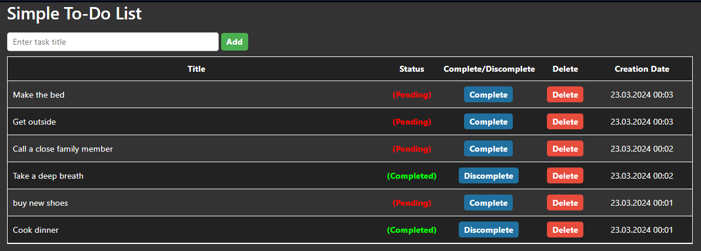

This project showcases a simple yet functional ToDoList application that allows users to add, delete, and mark tasks as completed. Built with ASP.NET Core, the application not only provides an easy-to-use user interface but also efficient data management using Entity Framework Core for database interactions.

Key Features:

* Adding tasks to the list
* Deleting tasks
* Marking tasks as completed

The application utilizes Entity Framework Core for data operations and uses SQL Server as the database management system, easily configured through appsettings.json.

